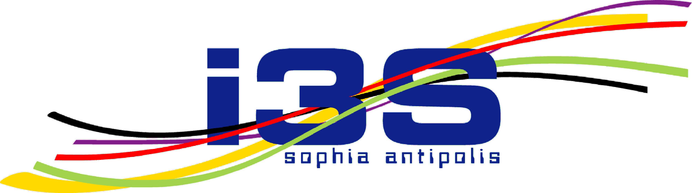
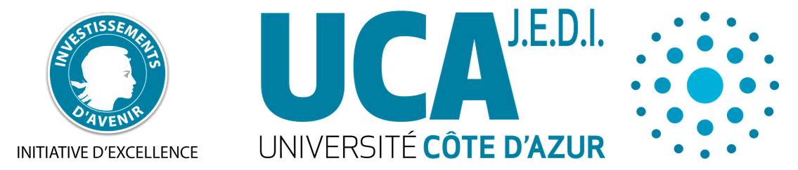
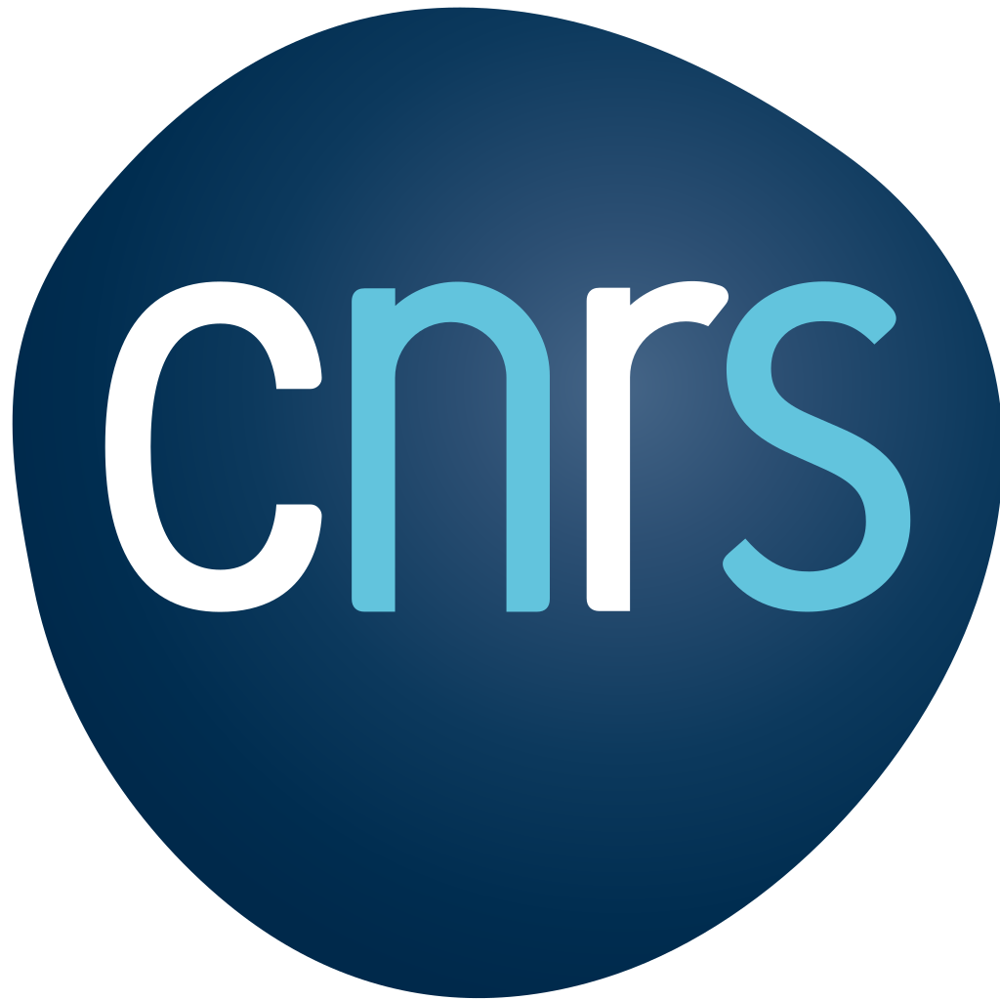

# WorldDynamics.jl

[](https://natema.github.io/WorldDynamics.jl/stable)
[](https://natema.github.io/WorldDynamics.jl/dev)
[](https://zenodo.org/badge/latestdoi/425565525)


An open-source framework written in Julia for world dynamics modeling and simulation.

## The World Dynamics Project

The World Dynamics project aims to provide a modern framework to investigate [models of global dynamics](https://en.wikipedia.org/wiki/Integrated_assessment_modelling) focused on sustainable development based on current software engineering and scientific machine learning techniques. Our group is developing a Julia library to allow scientists to easily use and adapt different world models, from [Meadows et al.'s World3](https://en.wikipedia.org/wiki/World3) to recent proposals. By enabling an open, interdisciplinary, and consistent comparative approach to scientific model development, our goal is to supply high-quality information to global policy making on environmental and economic issues.

### How to cite this work 

```
@software{pierluigi_crescenzi_2022_7093581,
  author       = {Pierluigi Crescenzi and
                  Emanuele Natale and
                  Paulo Bruno Serafim},
  title        = {WorldDynamics.jl: v0.1.0},
  month        = sep,
  year         = 2022,
  publisher    = {Zenodo},
  version      = {v0.1.0},
  doi          = {10.5281/zenodo.7093581},
  url          = {https://doi.org/10.5281/zenodo.7093581}
}
```

### Acknowledgments 

We thank for their support: 

[](https://www.i3s.unice.fr/fr)
[](https://ds4h.univ-cotedazur.eu/about-us/rise)
[](https://univ-cotedazur.fr/universite/ucajedi-lidex-duniversite-cote-dazur)

[](https://www.inria.fr/fr)
[](https://www.cnrs.fr/)

[](https://ing.uniroma2.it)
[](https://www.gssi.it/)